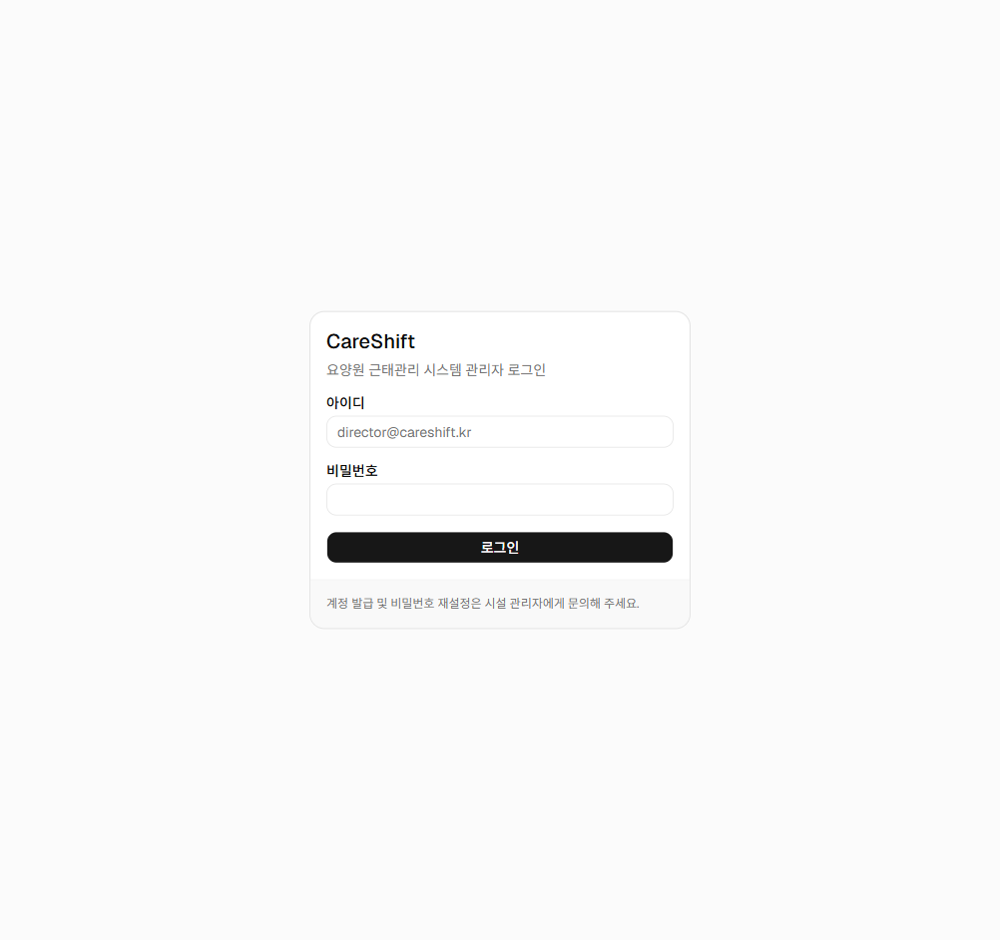
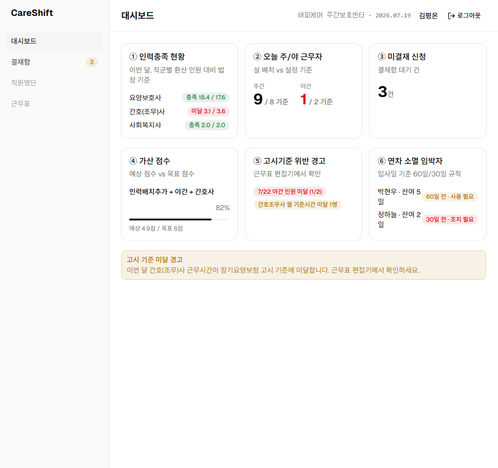

# 2026-07-19 관리자 로그인 구현 (백엔드 + 프론트)

## 개요

관리자 웹 로그인을 백엔드(NestJS)와 프론트(React) 양쪽에 수직 슬라이스로 구현했다.
기존에는 로그인 화면 껍데기만 있었고(무조건 `/dashboard` 이동) 모든 API가 인증 없이 열려 있었다.

## 인증 방식 결정

| 항목 | 결정 | 근거 |
|---|---|---|
| IdP | **로컬 자체 발급 JWT** (Cognito 아님) | architecture-v3 최종안은 Cognito Hosted UI지만 AWS 미구성. 가드의 `verifyJwt`만 JWKS 검증으로 교체하면 되는 구조로 작성 |
| 토큰 전달 | **httpOnly 쿠키** (`cs_access_token`, SameSite=Lax, 12h) | CLAUDE.md "토큰 localStorage 저장 금지". localhost:5173→3000은 same-site라 Lax로 동작 |
| 암호화 | **node:crypto만 사용** — scrypt(비밀번호), HMAC-SHA256(JWT) | CLAUDE.md "신규 라이브러리 추가는 사람 승인" — bcrypt/@nestjs/jwt/cookie-parser 미도입. 검증이 항상 자체 시크릿 HMAC 재계산이라 alg 혼동 공격 불성립 |
| 권한 소스 | `employee.system_role` 코드 매핑 (`permissions.guard.ts`) | RBAC 테이블(users/roles/permissions) 미도입. `@RequirePermissions` 시그니처는 유지한 채 도입 시 조회처만 교체 |
| 로그인 대상 | `systemRole ∈ {ADMIN, SUPER_ADMIN}` + `status=ACTIVE`만 허용 | 종사자(STAFF)는 모바일 기기등록+PIN 인증(C-13) 별도 Phase |

## 백엔드 (apps/api)

### DB — 수동 마이그레이션 `20260719000000_employee_login_credentials`
- `employee.email VARCHAR(255) NULL UNIQUE` (uq_employee_email), `employee.password_hash VARCHAR(255) NULL` 추가
- 로컬 DB에 `_prisma_migrations` 기준선이 없어(P3005) 기존 2개 마이그레이션을 `prisma migrate resolve --applied`로 baseline 후 deploy

### AuthModule (`src/auth/`)
| 파일 | 역할 |
|---|---|
| `password.util.ts` | scrypt 해시/검증 (`scrypt:<salt>:<hash>` 형식, seed에서 재사용) |
| `jwt.util.ts` | HS256 서명/검증 (sub=employee.id, 12h 만료) |
| `auth.constants.ts` | 쿠키 이름·옵션, JWT_SECRET DI 토큰 |
| `auth.service.ts` | 로그인 분기: INVALID_CREDENTIALS(401, 계정 존재 비노출) / ACCOUNT_INACTIVE(403) / ADMIN_ONLY(403) |
| `auth.controller.ts` | `POST /api/auth/login`(쿠키 발급, 토큰은 바디 미포함) · `POST /api/auth/logout`(204) · `GET /api/auth/me` |
| `jwt-auth.guard.ts` | **전역 가드**. 쿠키(기본)/Bearer(Swagger용) 추출 → 검증 → **매 요청 DB 재조회**(권한 변경·퇴사 즉시 반영 — architecture-v3 §3 "권한의 단일 소스는 MySQL") |
| `permissions.guard.ts` | 전역 `@RequirePermissions` 검사. systemRole→권한 매핑 |
| `decorators.ts` | `@Public` / `@RequirePermissions` / `@CurrentUser` |

### 기존 코드 반영
- `app.module.ts`: AuthModule 등록 (전역 가드 APP_GUARD 2개: 인증→인가 순)
- `main.ts`: CORS `credentials: true`
- `app.controller.ts`: 헬스체크 `@Public`
- `approvals.controller.ts`: `@RequirePermissions('approvals:read'|'approvals:decide')` 부착.
  결재자 식별은 여전히 body `approverId` — 시연 픽스처의 1차 결재자(사회복지사)가 STAFF라
  세션 기반 전환 시 결재 시연이 끊김. 종사자 인증 Phase에서 함께 정리(컨트롤러 TODO)
- `scripts/export-openapi.ts`: JWT_SECRET 더미 주입(DATABASE_URL 패턴)
- `.env` / `.env.example`: `JWT_SECRET` 추가(개발용 랜덤 값 / 플레이스홀더)

### 시드 계정 (로컬 개발용)
| 이메일 | 비밀번호 | 직원 | systemRole |
|---|---|---|---|
| director@careshift.kr | admin1234! | 김평온(시설장) | ADMIN |
| manager@careshift.kr | admin1234! | 박든든(사무국장) | ADMIN |

기존 행에도 반영되도록 upsert의 `update`에 자격증명을 포함했다.

## 프론트 (apps/web)

- `api/mutator.ts`: `credentials: 'include'` + 세션 만료(401, `/auth/*` 제외) 시 `/login` 전체 리로드
- `features/auth/session.ts`: 세션 사용자 모듈 캐시 + `requireAuth`(보호 라우트 beforeLoad) + `redirectIfAuthenticated`(/login 전용)
- 라우트: `/dashboard`·`/approvals`에 `beforeLoad: requireAuth`, `/`는 `/dashboard`로 리다이렉트, `/login`은 로그인 상태면 `/dashboard`로
- `features/auth/login-page.tsx`: Orval `useLogin` 연동, 서버 한국어 오류 메시지 표시, pending 상태 처리
- `components/shared/app-shell.tsx`: 헤더에 사용자 이름 + 로그아웃 버튼(`POST /auth/logout` → 세션 캐시 초기화 → `/login`)
- OpenAPI 재생성: `pnpm --filter api openapi:export && pnpm --filter web generate:api`

## 검증

- api: `pnpm test` 32건 통과(신규: jwt.util 5, password.util 4, auth.service 6), `pnpm lint` 에러 0, `pnpm build` 성공
- web: `pnpm build`(tsc + vite) 성공
- curl E2E: 미인증 401 → 오입력 401 → 로그인 200(HttpOnly 쿠키) → me 200 → 보호 API 200 → 로그아웃 204 → 재접근 401
- Playwright 브라우저 E2E: `/` → `/login` 리다이렉트, 오입력 시 오류 알림, 로그인 → 대시보드(헤더에 "김평온"+로그아웃), 로그아웃 → `/login`

## 남은 일 / 후속 과제

- [ ] Cognito 전환 시: `jwt.util` → JWKS 검증, `password.util` 폐기, email→Cognito username 매핑 (사람 검토 필수 항목)
- [ ] RBAC 테이블 도입 시 `permissions.guard.ts`의 역할 매핑을 DB 조회로 교체
- [ ] 결재 approve/reject의 결재자 식별을 body `approverId` → 세션 사용자로 전환(종사자 인증 Phase)
- [ ] 운영 배포 시 쿠키 `secure` 활성(NODE_ENV=production 분기 이미 존재), CORS origin 반영
